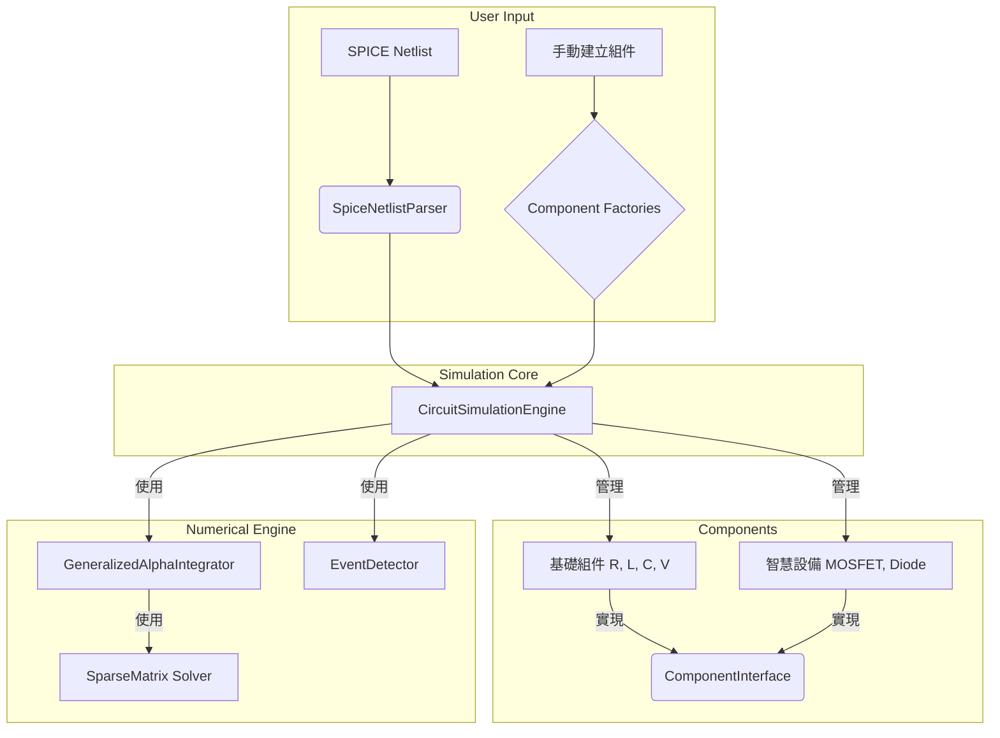

好的，這是一份根據您提供的最新程式碼庫完全更新的 AkingSPICE 2.1 專案架構與開發者指南。舊文件中的內容已被新架構的設計和實現細節所取代，並加入了針對新開發者的上手指南。

---

## AkingSPICE 2.1 增強版架構設計與開發者指南

### 1.0 專案概述

#### 1.1 專案定位
AkingSPICE 2.1 是一個專為現代電力電子應用設計的高性能、通用電路仿真引擎。它旨在前端網頁可以讓使用者輕鬆構建和模擬各種電力電子電路，從簡單的 DC-DC 轉換器到複雜的多相逆變器。核心目標包括：
*   **通用性**: 支持任意拓撲結構的 SPICE 電路。並且可以在網頁端撰寫控制器，控制目前所模擬的電路，以達到學習控制系統的目的。
*   **可擴展性**: 易於添加新元件和模型。


#### 1.2 核心技術支柱
*   **擴展修正節點分析 (Extended MNA)**: 作為核心數學框架，通過引入額外電流變數，原生支持電感、電壓源、變壓器等元件。`ExtraVariableIndexManager` 模塊專職管理此過程。
*   **統一組件接口 (`ComponentInterface`)**: 革命性的統一接口，消除了基礎元件與智能設備之間的架構鴻溝。所有電路元素，無論簡單或複雜，都通過統一的 `assemble(context)` 方法與仿真引擎交互。
*   **Generalized-α 積分器**: 採用 L-穩定、二階精度且具有可控數值阻尼的時間積分器，專為處理電力電子中的剛性微分代數方程組 (DAE) 而設計。
*   **事件驅動的瞬態分析**: 採用現代的 `EventDetector`，基於零交叉檢測和二分法精確定位開關事件，確保在不連續點的仿真精度和穩定性。
*   **魯棒的非線性求解器**: `CircuitSimulationEngine` 實現了先進的 Newton-Raphson 循環，並結合了多種全局收斂策略：
    *   **DC 分析**: 採用 **Source Stepping** 和 **Gmin Stepping** 等 Homotopy 方法確保收斂。
    *   **瞬態分析**: 應用 **步長阻尼 (Damped Steps)** 和 **線搜索 (Line Search)** 策略來處理強非線性問題。

### 2.0 系統架構

#### 2.1 架構流程圖
**SPICE 網表解析器** → **仿真引擎 (`CircuitSimulationEngine`)** → **MNA 系統構建 (含 `ExtraVariableManager`)** → **DC 分析求解器 (含 Homotopy)** → **瞬態分析求解器 (GeneralizedAlphaIntegrator + Newton-Raphson 循環)** → **稀疏矩陣求解器** → **波形數據存儲**。

#### 2.2 目錄結構與模塊職責


```
AkingSPICE/
└── src/
    ├── components/              # 🧩 通用基礎元件庫 (無狀態、可重用)
    │   ├── coupling/            # 耦合元件 (e.g., IdealTransformer)
    │   ├── passive/             # 無源元件 (Resistor, Inductor, Capacitor)
    │   └── sources/             # 獨立源 (VoltageSource)
    │
    ├── core/                    # 🔥 仿真引擎核心 (通用算法與框架)
    │   ├── devices/             # 🧠 智能非線性設備 (MOSFET, Diode) - 具備複雜狀態和收斂邏輯
    │   ├── events/              # 🔄 事件檢測系統 (EventDetector)
    │   ├── integrator/          # 📈 時間積分器 (Generalized-α)
    │   ├── interfaces/          # 📋 核心接口定義 (ComponentInterface, AssemblyContext)
    │   ├── mna/                 # ⚙️ MNA 系統構建與額外變量管理
    │   ├── parser/              # 📝 SPICE 網表解析器
    │   └── simulation/          # 🚀 仿真主引擎 (CircuitSimulationEngine)
    │
    ├── math/                    # 🧮 數學庫
    │   ├── numerical/           # 數值穩定性與安全工具
    │   └── sparse/              # 稀疏矩陣與向量實現
    │
    ├── types/                   # 🏷️ 全局類型定義 (IVector, ISparseMatrix, Time, etc.)
    │
    └── applications/            # 🎯 具體應用 (架構預留) - 使用核心引擎和元件庫構建特定電路
```

與src相同目錄下的ngspic 是 ngspic的原始碼，我們將要參考ngspic的部分程式碼來做修改我們的src

### 3.0 核心抽象與設計

#### 3.1 革命性的統一組件接口 (Unified Component Interface)

舊架構中 `stamp()` 和 `load()` 的分裂已被徹底解決。所有電路元素現在都遵循一個統一、清晰的契約。

*   **`AssemblyContext` (`/src/core/interfaces/component.ts`)**: 一個傳遞給所有組件的上下文對象，包含了 MNA 裝配所需的一切信息。
    ```typescript
    export interface AssemblyContext {
      readonly matrix: SparseMatrix;
      readonly rhs: Vector;
      readonly nodeMap: Map<string, number>;
      readonly currentTime: number;
      readonly dt: number;
      readonly solutionVector?: Vector;
      readonly previousSolutionVector?: Vector;
      readonly getExtraVariableIndex?: (name: string, type: string) => number | undefined;
    }
    ```

*   **`ComponentInterface` (`/src/core/interfaces/component.ts`)**: 所有元件的基石。
    ```typescript
    export interface ComponentInterface {
      readonly name: string;
      readonly type: string;
      readonly nodes: readonly (string | number)[];

      // 統一的組裝方法
      assemble(context: AssemblyContext): void;

      // 事件檢測相關 (可選)
      hasEvents?(): boolean;
      getEventFunctions?(): { type: string, condition: (v: IVector) => number }[];
      handleEvent?(event: IEvent, context: AssemblyContext): void;

      validate(): ValidationResult;
      getInfo(): ComponentInfo;
    }
    ```

#### 3.2 智能設備模型 (`IIntelligentDeviceModel`)

對於 MOSFET、Diode 等複雜非線性元件，它們不僅僅是被動地貢獻 MNA 矩陣，而是主動參與到仿真收斂的過程中。

*   **繼承與擴展**: `IIntelligentDeviceModel` 繼承自 `ComponentInterface`，並增加了控制非線性迭代的關鍵方法。
*   **核心職責**:
    *   `assemble()`: 實現統一的組裝接口，內部通常調用一個私有的 `load()` 方法來計算當前工作點的線性和非線性貢獻。
    *   `checkConvergence()`: 允許設備根據其物理特性（如工作區是否穩定）來判斷收斂性。
    *   `limitUpdate()`: 在 Newton 迭代發散時，對電壓更新步長 `deltaV` 進行限制，防止出現非物理的解。
    *   `getEventFunctions()`: 向事件檢測器提供條件函數，用於精確定位狀態轉換（如 Vgs 穿過 Vth）。

#### 3.3 擴展 MNA 與 `ExtraVariableIndexManager`

*   **為何需要擴展?**: 標準 MNA 只能求解節點電壓。對於電壓源、電感等元件，它們的支路電流也是未知的。擴展 MNA 將這些電流作為新的未知數加入到求解向量 `x` 中。
*   **管理器職責 (`/src/core/mna/extra_variable_manager.ts`)**:
    1.  在仿真初始化時，遍歷所有元件。
    2.  調用元件的 `getExtraVariableCount()` 方法（如果存在）來確定需要多少個額外變量。
    3.  為每個請求分配一個唯一的索引，該索引大於所有節點電壓的索引。
    4.  將分配的索引通過 `setCurrentIndex()` 或 `setCurrentIndices()` 等方法回傳給元件。
*   **元件實現**: 需要額外變量的元件（如 `Inductor`, `VoltageSource`, `IdealTransformer`）在其 `assemble` 方法中使用這些預先分配好的索引來填充擴展 MNA 矩陣的 `B`, `C`, `D` 部分。

### 4.0 開發者指南

#### 4.1 如何接手開發與貢獻

1.  **理解架構分層**:
    *   **添加新基礎元件** (例如：憶阻器): 在 `src/components/` 下創建新模塊，實現 `ComponentInterface`。
    *   **添加新智能半導體** (例如：IGBT): 在 `src/core/devices/` 下創建新模塊，繼承 `IntelligentDeviceModelBase`。
    *   **實現新電路應用** (例如：三相逆變器): 在預留的 `src/applications/` 目錄下創建，並使用元件工廠 (`TransformerFactory`, `CapacitorFactory`) 和智能設備工廠 (`SmartDeviceFactory`) 來程序化構建電路。
    *   **改進數值算法**: 修改 `src/core/integrator/` (積分器) 或 `src/core/simulation/` (非線性求解策略) 中的對應模塊。

2.  **開發新元件的標準流程**:

    **案例 1: 簡單無源元件 (例如：一個非線性電阻)**
    1.  **文件創建**: 在 `src/components/passive/` 下創建 `nonlinear_resistor.ts`。
    2.  **接口實現**: 實現 `ComponentInterface`。
    3.  **核心實現 `assemble()`**:
        ```typescript
        assemble(context: AssemblyContext): void {
          // 從 context.solutionVector 獲取當前節點電壓
          const v1 = context.solutionVector.get(nodeIndex1);
          const v2 = context.solutionVector.get(nodeIndex2);
          const v = v1 - v2;

          // 根據非線性關係 I = f(V) 計算電流和動態電導 g = dI/dV
          const current = f(v);
          const conductance = df_dv(v);

          // 裝配 Jacobian (電導矩陣)
          context.matrix.add(nodeIndex1, nodeIndex1, conductance);
          // ...

          // 裝配 RHS (殘差向量)
          // I_eq = I_nonlinear - G_linear * V
          const equivalentCurrent = current - conductance * v;
          context.rhs.add(nodeIndex1, -equivalentCurrent);
          context.rhs.add(nodeIndex2, equivalentCurrent);
        }
        ```
    4.  **解析器集成**: 更新 `SpiceNetlistParser` 以識別和創建此元件。
    5.  **單元測試**: 編寫測試驗證 `assemble` 方法的正確性。

    **案例 2: 需要額外變量的元件 (例如：電流控制電壓源 CCVS)**
    1.  **文件創建**: `src/components/controlled_sources/ccvs.ts`。
    2.  **接口實現**: 實現 `ComponentInterface`。
    3.  **聲明變量需求**:
        ```typescript
        getExtraVariableCount(): number {
          return 1; // 需要一個額外變量來表示輸出電壓源的電流
        }
        setCurrentIndex(index: number): void {
          this._outputCurrentIndex = index;
        }
        ```
    4.  **核心實現 `assemble()`**:
        *   使用 `_outputCurrentIndex` 來填充擴展 MNA 矩陣的 `B` 和 `C` 部分，類似 `VoltageSource`。
        *   實現控制關係 `V_out = r * I_control` 作為一個新的支路方程，填充到擴展矩陣的 `D` 部分。
    5.  **測試**: 編寫測試驗證控制關係和 MNA 矩陣裝配的正確性。

#### 4.2 項目規範
*   **目標導向**: 所有開發決策應以達成**通用電力電子模擬器**為目標，避免為特定應用範例進行硬編碼。
*   **代碼規範**: 項目內只存放 `.ts` 原始碼。所有 `.js` 文件均為編譯產物，不應提交到 `src` 或其任何子目錄中。

### 5.0 成功標準
AkingSPICE 2.1 的成功由以下幾點衡量：
*   ✅ **可擴展性**: 新開發者可以輕鬆地添加從簡單線性元件到複雜智能設備的各類模型。
*   ✅ **通用性**: 能夠準確仿真任意拓撲的 SPICE 電路，而不局限於特定類型。
*   ✅ **解耦性**: 核心仿真算法（積分、求解）與具體的元件物理模型完全分離。
*   ✅ **魯棒性**: 對於電力電子中常見的剛性、強非線性問題具有工業級的收斂性和數值穩定性。
*   ✅ **高性能**: 能夠利用稀疏數據結構和高效求解器處理大規模電路（千節點級別）。

好的，這份文件將作為 AkingSPICE 2.1 的 API 參考與開發者手冊。旨在幫助新的開發人員快速理解系統架構、遵循設計模式，並高效地進行後續開發。

---

# AkingSPICE 2.1 API 參考與開發者手冊

## 1. 導論

歡迎來到 AkingSPICE 2.1 開發團隊！這是一套專為電力電子應用設計的高性能電路模擬引擎。為了確保代碼的品質、可維護性與擴展性，我們採用了一套現代化的設計架構。

**核心設計原則：**

1.  **統一組件接口 (`ComponentInterface`)**：無論是簡單的電阻，還是複雜的智慧型 MOSFET，所有電路元件都實現同一個核心接口。這大大簡化了仿真引擎的設計。
2.  **工廠模式 (`Factory Pattern`)**：所有組件實例都必須透過對應的工廠（如 `ResistorFactory`, `SmartDeviceFactory`）來創建。**嚴禁直接使用 `new` 關鍵字實例化組件**，以確保一致性與未來擴展性。
3.  **依賴注入與上下文 (`AssemblyContext`)**：組件在組裝（`assemble`）時，會由引擎傳入一個包含所有必要資訊的上下文物件，實現了組件與引擎的解耦。
4.  **事件驅動架構 (`Event-Driven`)**：透過 `getEventFunctions` 和 `handleEvent`，系統能精確捕捉並處理非線性元件的狀態轉換，提升仿真精度與效率。

本手冊分為兩部分：**開發者手冊** 將引導您了解如何使用和擴展系統；**API 參考** 則提供關鍵模組的詳細說明。

---

## 2. 開發者手冊 (Developer Guide)

### 2.1 核心架構概覽

AkingSPICE 2.1 的核心架構圍繞 `CircuitSimulationEngine` 展開，它負責協調各個模組完成仿真任務。



**流程簡述：**

1.  **輸入**: 使用者可以透過 SPICE 網表 (`SpiceNetlistParser`) 或直接呼叫**組件工廠 (`Component Factories`)** 來定義電路。
2.  **組裝**: `CircuitSimulationEngine` 收集所有組件 (`ComponentInterface`)。
3.  **求解**: 引擎驅動 `GeneralizedAlphaIntegrator` 進行時域積分。在每個時間步中：
    *   引擎呼叫每個組件的 `assemble()` 方法，將其對 MNA 方程的貢獻填充到 `SparseMatrix` 中。
    *   使用 `SparseMatrix Solver` 求解線性化的 MNA 方程。
    *   `EventDetector` 檢查是否有狀態轉換事件發生，並精確地定位事件時間。

### 2.2 基本操作流程 (Workflow)

以下是使用 AkingSPICE 2.1 進行一次仿真的標準流程。

**步驟 1：定義電路**

**黃金準則：永遠透過工廠 (`Factory`) 建立組件，絕不自行 `new` 組件實例。**

```typescript
import { ResistorFactory } from './components/passive/resistor';
import { VoltageSourceFactory } from './components/sources/voltage_source';
import { SmartDeviceFactory } from './core/devices/intelligent_device_factory';
import { CircuitSimulationEngine } from './core/simulation/circuit_simulation_engine';

// 1. 使用工廠創建基礎組件
const v1 = VoltageSourceFactory.createDC('V1', ['n1', '0'], 12);
const r1 = ResistorFactory.create('R1', ['n1', 'n2'], 1000); // 1kΩ

// 2. 使用工廠創建智慧設備 (例如：一個續流二極管)
const d1 = SmartDeviceFactory.createFreewheelDiode('D1', ['0', 'n2'], 12, 1);

const components = [v1, r1, d1];
```

**步驟 2：建立並配置仿真引擎**

```typescript
// 3. 建立仿真引擎實例
const engine = new CircuitSimulationEngine({
  endTime: 1e-3, // 仿真 1ms
  initialTimeStep: 1e-7, // 初始步長 100ns
});
```

**步驟 3：將組件加入引擎並運行**

```typescript
// 4. 將所有組件加入引擎
engine.addDevices(components);

// 5. 運行仿真
async function run() {
  try {
    const result = await engine.runSimulation();
    if (result.success) {
      console.log('仿真成功完成！');
      // 處理 result.waveformData ...
    } else {
      console.error('仿真失敗:', result.errorMessage);
    }
  } catch (error) {
    console.error('仿真過程中發生嚴重錯誤:', error);
  }
}

run();
```

### 2.3 如何開發一個新的電路組件

開發新組件是擴展 AkingSPICE 功能的核心。所有組件都必須實現 `ComponentInterface` 接口。

**範例：實現一個簡單的非線性電阻 (電壓相關電阻)**

假設我們要建立一個電阻，其電阻值 `R = R0 * (1 + alpha * V)`，其中 V 是跨壓。

**`./src/components/passive/voltage_dependent_resistor.ts`**

```typescript
import { AssemblyContext, ComponentInterface, ValidationResult } from '../../core/interfaces/component';

export class VoltageDependentResistor implements ComponentInterface {
  readonly type = 'R_VDR';

  constructor(
    public readonly name: string,
    public readonly nodes: readonly [string, string],
    private readonly r0: number,
    private readonly alpha: number
  ) {
    // 構造函數中應包含基本的參數驗證
    if (r0 <= 0) {
      throw new Error('R0 must be positive.');
    }
  }

  /**
   * 核心方法：將組件貢獻添加到 MNA 系統
   */
  assemble(context: AssemblyContext): void {
    const { nodeMap, solutionVector, matrix } = context;

    // 1. 獲取節點索引
    const n1 = nodeMap.get(this.nodes[0]);
    const n2 = nodeMap.get(this.nodes[1]);

    // 2. 從解向量獲取當前跨壓 (用於計算非線性電阻值)
    //    solutionVector 可能為 undefined (例如在 DC 分析的第一步)
    const v1 = (n1 !== undefined && solutionVector) ? solutionVector.get(n1) : 0;
    const v2 = (n2 !== undefined && solutionVector) ? solutionVector.get(n2) : 0;
    const v = v1 - v2;

    // 3. 計算當前工作點的電導 G = 1/R
    const resistance = this.r0 * (1 + this.alpha * v);
    const conductance = 1.0 / resistance;

    // 4. 將電導值 "蓋印" (stamp) 到 MNA 矩陣
    //    這是標準電阻的蓋印模式
    if (n1 !== undefined && n1 >= 0) {
      matrix.add(n1, n1, conductance);
      if (n2 !== undefined && n2 >= 0) {
        matrix.add(n1, n2, -conductance);
      }
    }
    if (n2 !== undefined && n2 >= 0) {
      matrix.add(n2, n2, conductance);
      if (n1 !== undefined && n1 >= 0) {
        matrix.add(n2, n1, -conductance);
      }
    }
    
    // 5. 對於非線性元件，還需要計算並蓋印等效電流源到 RHS
    //    I_eq = I(V) - G(V) * V
    const current = v / resistance;
    const ieq = current - conductance * v;
    
    if (n1 !== undefined && n1 >= 0) {
        context.rhs.add(n1, -ieq);
    }
    if (n2 !== undefined && n2 >= 0) {
        context.rhs.add(n2, ieq);
    }
  }
  
  // ... 實現 ComponentInterface 的其他方法 (validate, getInfo, computeCurrent)
}
```

---

## 3. API 參考 (API Reference)

### 3.1 核心接口

#### 3.1.1 `ComponentInterface`
**路徑**: `src/core/interfaces/component.ts`

所有電路組件的基礎。

| 屬性/方法 | 類型 | 描述 |
| :--- | :--- | :--- |
| `name` | `string` | 組件的唯一實例名稱 (例如 "R1")。 |
| `type` | `string` | 組件類型 (例如 "R", "C", "MOSFET")。 |
| `nodes` | `readonly (string \| number)[]` | 組件連接的節點名稱列表。 |
| `assemble(context)` | `void` | **核心方法**。將此組件對 MNA 系統的貢獻（電導、電流源等）添加到 `AssemblyContext` 中。 |
| `validate()` | `ValidationResult` | 驗證組件的參數是否有效。在加入引擎時被呼叫。 |
| `getInfo()` | `ComponentInfo` | 返回用於調試和顯示的組件資訊。 |
| `computeCurrent(voltages, context?)`| `number` | 根據給定的完整電壓解向量，計算流過此組件的電流。 |
| `hasEvents?()` | `boolean` | (可選) 返回 `true` 如果此組件可能觸發狀態轉換事件。 |
| `getEventFunctions?()` | `Function[]` | (可選) 返回一個或多個條件函數，其零點對應一個事件。 |
| `handleEvent?(event, context)` | `void` | (可選) 處理一個已確認發生的事件，例如更新內部狀態。 |

#### 3.1.2 `AssemblyContext`
**路徑**: `src/core/interfaces/component.ts`

在 `assemble` 過程中傳遞給組件的上下文物件，包含了組裝所需的所有資訊和工具。

| 屬性 | 類型 | 描述 |
| :--- | :--- | :--- |
| `matrix` | `SparseMatrix` | MNA 系統的雅可比矩陣 (J)。 |
| `rhs` | `Vector` | MNA 系統的右側向量 (b)。 |
| `nodeMap` | `Map<string, number>` | 節點名稱到矩陣索引的映射。 |
| `currentTime` | `number` | 當前的仿真時間。 |
| `dt` | `number` | 當前的時間步長。DC 分析時為 0。 |
| `solutionVector?` | `Vector` | 當前 Newton 迭代的解向量 (x_k)，供非線性元件使用。 |
| `previousSolutionVector?` | `Vector` | 上一個**已收斂**時間步的解向量，用於計算歷史項。 |
| `getExtraVariableIndex?` | `Function` | 獲取額外變量（如電感電流）在矩陣中的索引。 |
| `G_coeff?`, `R_coeff?` | `number` | 由積分器提供的係數，用於計算電容/電感的伴隨模型。 |

### 3.2 主要模組

#### 3.2.1 `CircuitSimulationEngine`
**路徑**: `src/core/simulation/circuit_simulation_engine.ts`

仿真的主控制器。

**主要方法**:

*   `constructor(config: Partial<SimulationConfig>)`: 創建引擎實例，可傳入部分配置來覆蓋預設值。
*   `addDevice(device: ComponentInterface): void`: 添加單個組件到電路中。
*   `addDevices(devices: ComponentInterface[]): void`: 批量添加組件。
*   `async runSimulation(): Promise<SimulationResult>`: 異步執行完整的仿真流程，並在結束後返回結果。

#### 3.2.2 `SpiceNetlistParser`
**路徑**: `src/core/parser/spice_netlist_parser.ts`

負責將 SPICE 格式的文本網表解析為電路元件。

**主要方法**:

*   `parseNetlist(netlistContent: string): ParsedNetlist`: 解析網表字符串，返回一個包含所有元素、模型和分析命令的結構化物件。
*   `createDevicesFromNetlist(parsedNetlist: ParsedNetlist): ComponentInterface[]`: 將解析結果轉換為引擎可用的 `ComponentInterface` 實例數組。

#### 3.2.3 組件工廠 (Component Factories)

所有組件的創建都應透過這些工廠完成。它們確保了組件被正確地初始化。

**基礎組件工廠**:

*   **`ResistorFactory`**: `src/components/passive/resistor.ts`
    *   `create(name, nodes, resistance)`: 創建一個標準電阻。
*   **`CapacitorFactory`**: `src/components/passive/capacitor.ts`
    *   `create(name, nodes, capacitance)`: 創建一個標準電容。
*   **`InductorFactory`**: `src/components/passive/inductor.ts`
    *   `create(name, nodes, inductance)`: 創建一個標準電感。
*   **`VoltageSourceFactory`**: `src/components/sources/voltage_source.ts`
    *   `createDC(name, nodes, voltage)`: 創建直流電壓源。
    *   `createSine(...)`: 創建正弦波電壓源。
    *   `createPulse(...)`: 創建脈衝電壓源。

**智慧設備工廠**:

*   **`SmartDeviceFactory`**: `src/core/devices/intelligent_device_factory.ts`
    *   `createMOSFET(deviceId, nodes, parameters)`: 創建一個智慧型 MOSFET 模型。
    *   `createDiode(deviceId, nodes, parameters)`: 創建一個智慧型二極管模型。
    *   `createBuckMOSFET(...)`, `createFreewheelDiode(...)`: 提供針對特定應用（如 Buck 變換器）的預設配置模型。

#### 3.2.4 `ngdevices` 模組
**路徑**: `src/core/ngdevices/`

此目錄包含一組遵循 `ngspice` 內部模型實現的非線性元件 (`NgDiode`, `NgMosfet`)。這些模型提供了與 `intelligent_devices` 不同的數值特性和收斂行為，可作為備選方案。

*   **`NgDeviceFactory`**: `src/core/ngdevices/ng_device_factory.ts`
    *   提供創建 `NgDiode` 和 `NgMosfet` 的方法。

開發時，應優先使用 `intelligent_devices` 模組，因為它們是為 AkingSPICE 2.1 的現代架構（如事件檢測）專門設計的。

---

## 4. 結論與最佳實踐

1.  **永遠使用工廠**: 這是最重要的一條規則。它保證了創建組件的統一入口。
2.  **專注於 `assemble` 方法**: 開發新組件時，`assemble` 方法是與仿真引擎互動的核心。確保在此方法中正確地將組件的 MNA 貢獻添加到 `AssemblyContext`。
3.  **善用 `AssemblyContext`**: 不要讓組件直接依賴引擎或積分器。所有需要的資訊都應從 `context` 中獲取。
4.  **區分基礎組件與智慧設備**:
    *   無狀態、線性的元件應作為基礎組件放在 `src/components/`。
    *   需要複雜狀態管理、非線性行為和事件檢測的元件，應作為智慧設備放在 `src/core/devices/`。
5.  **編寫清晰的 `validate` 方法**: 在 `validate()` 中提供明確的參數檢查，可以在仿真開始前就發現問題。

遵循以上指南，將有助於您快速融入 AkingSPICE 2.1 的開發，並維護一個清晰、高效、可擴展的仿真平台。


